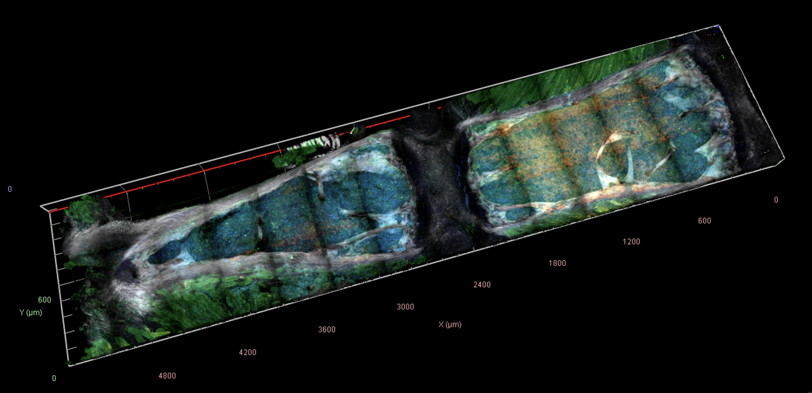
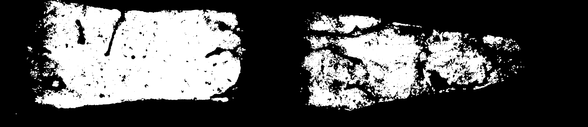
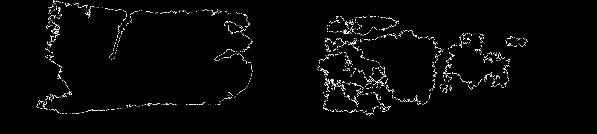
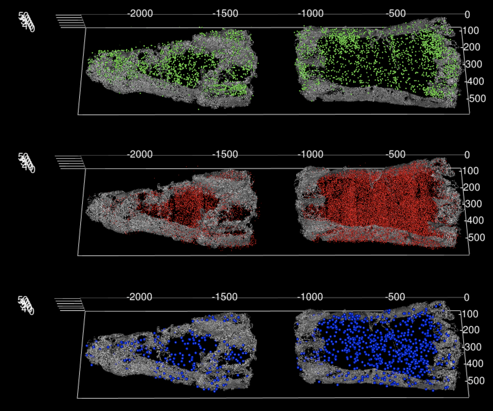

# Introduction

In this repo I provide an code example which extracts the contours from a 3D microscopy image of bone marrow. In reality, this an snippet from a larger code base which I've abbreviated for the purpose of brevity. 

The reason for extracting marrow contours is for the purpose of (1.) 3D spatial modelling of the marrow and (2.) visualisation. For modelling, it is better to have the contours in their '_raw_' form. For visualisation - it is often more convenient to load the contours into a geopandas dataframe. Examples of the two forms are shown below:

```python
# 3D contours
[[0, 1, 1], [0, 2, 3] ... [70, 700, 1200]]

# geopandas dataframe
>>> gdf.head()
   z_level                                           geometry
0        0  MULTIPOLYGON (((6929.000 822.000, 6928.000 823...
1        1  MULTIPOLYGON (((10768.000 800.000, 10766.000 8...
2        2  MULTIPOLYGON (((7163.000 1121.000, 7162.000 11...
3        3  MULTIPOLYGON (((10768.000 799.000, 10767.000 8...
4        4  MULTIPOLYGON (((875.000 1509.000, 874.000 1510...

```

### Steps in the process

1. Generate a segmented image of the tissue (not bone) +/- block-reduce the image (for convenience) [_code not shown_]


2. Pad the image

3. Extract the outermost contours of the tissue

4. Generate a new filled image with only the binary (filled) contours of the image; this can be loaded into the `img2df` class 

5. `img2df` class can be used to extract the contours and convert the forms needed [**Note**; from an engineering perspective the repeated contour extraction may seem a unnecessary but this is in-part because this is an _artificial example_]

### Examples of steps

a.) original image (sternal bone with bone marrow within it)


b.) Binary segmented sample


c.) Final extracted contours for a single z level 


d.) Example 3d reconstruction with different cell types show

